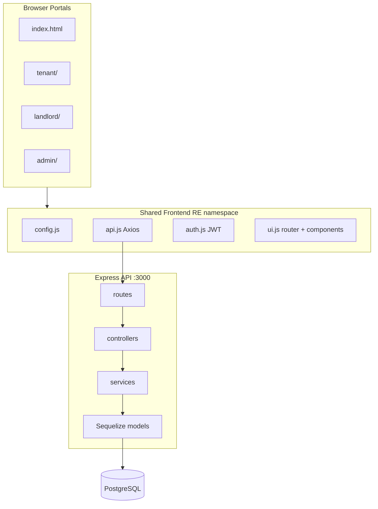
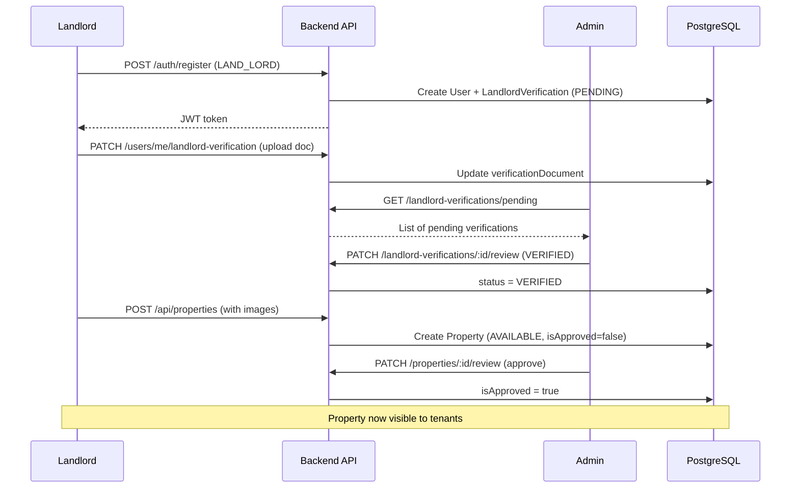
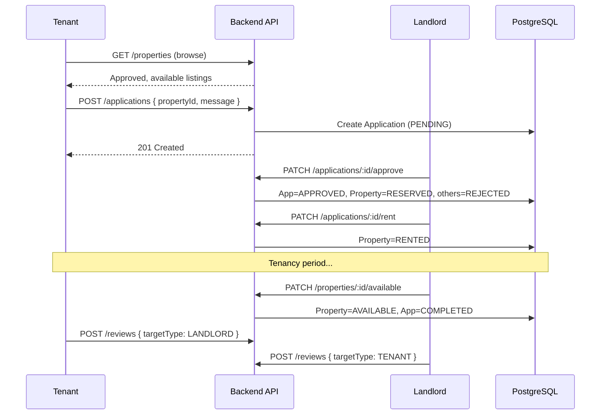
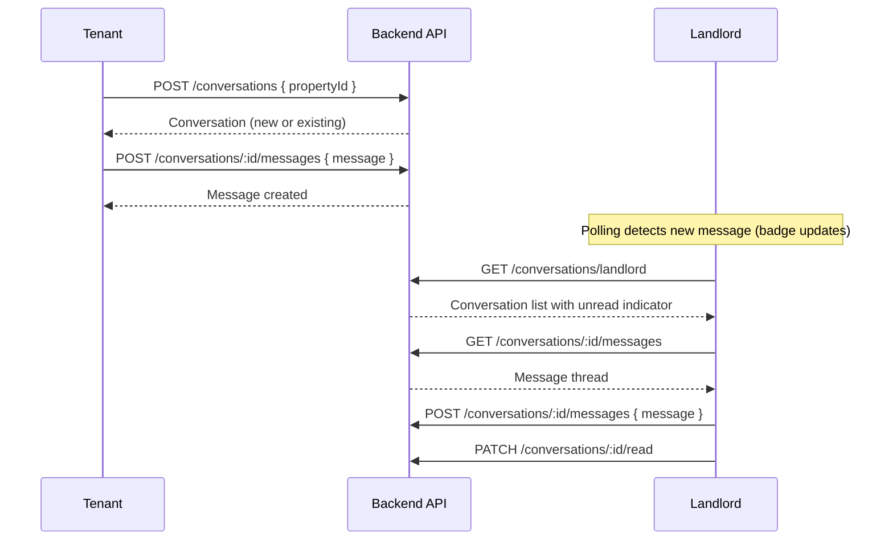
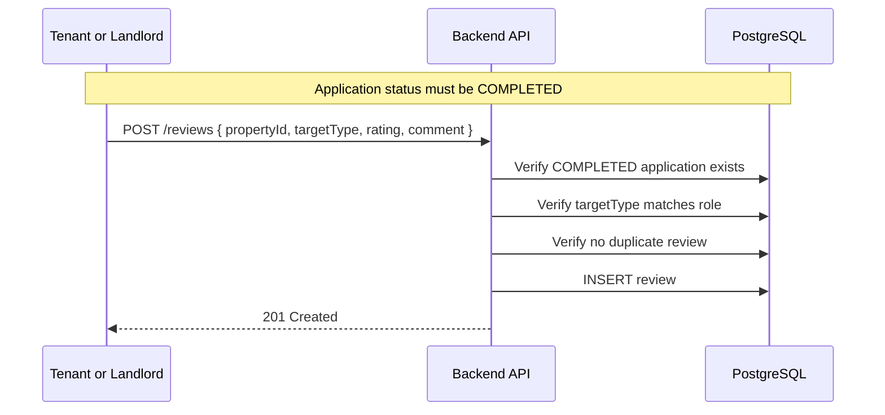
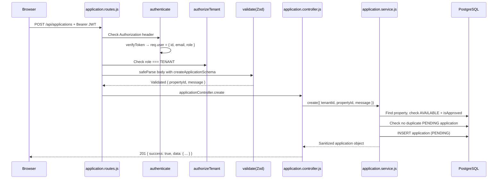

# RentEase — Junior Developer Guide

> **Purpose of this document:** Everything a junior developer needs to understand RentEase end-to-end — what it does, why it was built this way, how each layer works, and how to demo it confidently in front of an audience.

**Companion docs (quick reference):**
- [README.md](README.md) — project overview and quick start
- [backend/README.md](backend/README.md) — full API endpoint reference, migrations, Swagger
- [frontend/README.md](frontend/README.md) — portal routes, styling conventions, dev guide

---

## Table of Contents

1. [Introduction and Learning Path](#1-introduction-and-learning-path)
2. [System Architecture](#2-system-architecture)
3. [Tech Stack and Libraries](#3-tech-stack-and-libraries)
4. [Database Schema and State Machines](#4-database-schema-and-state-machines)
5. [End-to-End Business Workflows](#5-end-to-end-business-workflows)
6. [Backend Deep Dive](#6-backend-deep-dive)
7. [Frontend Deep Dive](#7-frontend-deep-dive)
8. [Presentation and Demo Script](#8-presentation-and-demo-script)
9. [FAQ — Questions You Might Get](#9-faq--questions-you-might-get)

---

## 1. Introduction and Learning Path

### What is RentEase?

RentEase is a **property rental platform**. It connects three types of users:

| Actor | Role constant | Portal | What they do |
|-------|---------------|--------|--------------|
| **Tenant** | `TENANT` | `/tenant/` | Browse approved listings, apply to rent, message landlords, leave reviews after a completed rental |
| **Landlord** | `LAND_LORD` | `/landlord/` | Get identity-verified, list properties, manage applications, message tenants, leave reviews |
| **Admin** | `ADMIN` | `/admin/` | Moderate landlord identity documents, approve property listings, manage users and amenities |

The system is a **monorepo** with two parts:

```
RentEase/
├── backend/    # Node.js REST API (Express + Sequelize + PostgreSQL)
└── frontend/   # Three static HTML/CSS/JS portals + shared code
```

There is **no frontend build step**. Each portal is a set of static files served over HTTP. The backend is a conventional layered Express API.

### Suggested Learning Path

Read this guide in order. Estimated study time: **2–3 hours**.

| Step | Section | Time | Goal |
|------|---------|------|------|
| 1 | Section 1 + run the project locally | 20 min | Get both servers running, log into each portal |
| 2 | Section 2 — Architecture | 15 min | Understand the big picture |
| 3 | Section 4 — Database & state machines | 25 min | Learn the status enums — they drive every workflow |
| 4 | Section 5 — Business workflows | 40 min | Trace each user journey end-to-end |
| 5 | Section 6 — Backend deep dive | 30 min | Understand how a request flows through the API |
| 6 | Section 7 — Frontend deep dive | 30 min | Understand routing, auth, and page patterns |
| 7 | Section 8 — Demo script | 20 min | Practice the live presentation |

### Running the Project Locally

**Prerequisites:** Node.js 18+, PostgreSQL

**Terminal 1 — Backend API:**

```bash
cd backend
npm install
cp .env.example .env        # edit DB credentials and JWT_SECRET if needed
createdb rentease_dev       # create PostgreSQL database (once)
npm run db:migrate          # run all migrations (once)
npm run dev                 # starts API at http://localhost:3000
```

**Terminal 2 — Frontend:**

```bash
# from repo root
npx serve frontend -p 8080  # starts static server at http://localhost:8080
```

**Verify it works:**

| URL | What you should see |
|-----|---------------------|
| http://localhost:8080/ | Landing page with three portal links |
| http://localhost:3000/api/health | `{"success":true,"data":{"status":"ok"}}` |
| http://localhost:3000/api-docs | Swagger UI (development only) |

### Test Accounts

| Role | Email | Password | How to get it |
|------|-------|----------|---------------|
| **Admin** | `admin@rentease.com` | `admin_password` | Seeded automatically by the first database migration |
| **Tenant** | (your choice) | (your choice) | Register at `/tenant/#/register` |
| **Landlord** | (your choice) | (your choice) | Register at `/landlord/#/register` |

> **Tip for demos:** Register a fresh landlord and tenant before the presentation so you control the full lifecycle. Keep the admin account for moderation steps.

### Project Layout at a Glance

```
RentEase/
├── DEVELOPER_GUIDE.md          ← you are here
├── README.md
├── backend/
│   ├── src/
│   │   ├── server.js           # Entry point — connects DB, starts HTTP server
│   │   ├── app.js              # Express middleware + route mounting
│   │   ├── config/             # DB, JWT, logger, upload, Swagger
│   │   ├── constants/          # Enums: roles, statuses, property types
│   │   ├── controllers/      # Thin HTTP handlers
│   │   ├── docs/               # OpenAPI path definitions
│   │   ├── middleware/         # Auth, validation, uploads, errors
│   │   ├── models/             # Sequelize ORM models (10 tables)
│   │   ├── routes/             # Express route definitions
│   │   ├── schemas/            # Zod validation schemas
│   │   ├── services/           # Business logic (the important layer)
│   │   └── utils/              # AppError, asyncHandler, pagination, JWT
│   ├── migrations/             # Versioned database schema changes
│   └── uploads/                # Local file storage (profiles, properties, ID docs)
└── frontend/
    ├── index.html              # Landing page
    ├── css/                    # Shared design system
    ├── js/                     # Shared modules (global RE namespace)
    ├── tenant/                 # Tenant portal
    ├── landlord/               # Landlord portal
    └── admin/                  # Admin portal
```

---

## 2. System Architecture

### High-Level Diagram



### How the Pieces Talk to Each Other

1. **User opens a portal** in the browser (e.g. `http://localhost:8080/tenant/`).
2. **Static HTML loads** a chain of `<script>` tags — shared modules first, then portal-specific pages, then the router.
3. **Hash router** (`#/applications`) picks a page render function and injects HTML into `<main id="app">`.
4. **Page code calls `RE.api.*`** which uses Axios to hit `http://localhost:3000/api/...`.
5. **Axios interceptor** attaches `Authorization: Bearer <token>` from `localStorage` on every request.
6. **Express route** runs middleware (auth → role check → Zod validation), then calls a controller.
7. **Controller** calls a service method and returns `{ success: true, data: ... }`.
8. **Service** enforces business rules, runs Sequelize queries/transactions against PostgreSQL.
9. **Response** flows back to the browser; the page updates `innerHTML` and binds event handlers.

### Key Design Decisions (The "Why")

Understanding *why* things were built this way is as important as knowing *what* they do.

#### Monorepo, no frontend bundler

The frontend uses **vanilla HTML/CSS/JS** with no Webpack, Vite, or React. Three portals share code via a global `window.RE` namespace loaded by `<script>` tags.

**Why?** Simplicity. A junior developer can open any file, read it top-to-bottom, and understand it. No transpilation, no `node_modules` on the frontend, no build step. Each portal is independently servable with `npx serve`.

**Trade-off:** No component framework, no type checking, no hot module replacement. For a learning/demo project, the simplicity wins.

#### Hash routing (`#/path`)

URLs look like `http://localhost:8080/tenant/#/applications`. The part after `#` is handled entirely in JavaScript — the server always returns the same `index.html`.

**Why?** Static file servers (`npx serve`) don't support server-side URL rewriting (which SPAs like React Router need). Hash routing works everywhere with zero server configuration.

#### Backend layered architecture

```
Routes → Controllers → Services → Models
```

- **Routes** wire HTTP methods to handlers and attach middleware.
- **Controllers** are thin — they parse the request, call one service method, format the JSON response.
- **Services** contain all business logic — validation rules, ownership checks, database transactions.
- **Models** define the database schema and associations.

**Why?** Separation of concerns. If you need to change "what happens when a landlord approves an application," you look in `application.service.js` — not scattered across route files and controllers.

#### JWT + localStorage

Authentication is **stateless**. The server signs a JWT containing `{ sub: userId, email, role }`. The frontend stores it in `localStorage` and sends it on every request.

**Why?** No server-side session store needed. The API can verify any request independently. Three separate portal HTML pages can all share the same token.

#### Two-axis admin gate

Before a property is visible to tenants, **two things** must be approved:

1. **Landlord identity** — admin verifies the landlord uploaded a real ID document.
2. **Property listing** — admin reviews the listing details and photos.

**Why?** Trust and safety. Tenants should only see listings from verified landlords with admin-approved content.

---

## 3. Tech Stack and Libraries

### Backend Libraries

| Library | Version | What it does | Why we use it |
|---------|---------|--------------|---------------|
| **express** | ^4.21 | HTTP server and routing | Industry-standard Node.js web framework; middleware pipeline model is easy to learn |
| **sequelize** | ^6.37 | ORM for PostgreSQL | Maps JS objects to SQL tables; handles associations, migrations, transactions |
| **pg** | ^8.13 | PostgreSQL driver | Sequelize needs a driver to talk to Postgres |
| **pg-hstore** | ^2.3 | HStore serialization | Required Sequelize dependency for PostgreSQL |
| **bcrypt** | ^6.0 | Password hashing | One-way hash — passwords are never stored in plaintext |
| **jsonwebtoken** | ^9.0 | JWT sign/verify | Stateless authentication; token payload carries user identity and role |
| **zod** | ^3.24 | Schema validation | Type-safe request validation with clear error messages |
| **@asteasolutions/zod-to-openapi** | ^7.3 | Zod → OpenAPI | Single source of truth: define a Zod schema once, use it for both validation and Swagger docs |
| **multer** | ^2.2 | Multipart file uploads | Handles `multipart/form-data` for profile images, property photos, ID documents |
| **cors** | ^2.8 | Cross-Origin Resource Sharing | Allows the frontend on `:8080` to call the API on `:3000` |
| **dotenv** | ^16.4 | Environment variables | Loads `.env` file so secrets aren't hardcoded |
| **pino** | ^9.6 | Structured logging | JSON logs in production; human-readable with `pino-pretty` in dev |
| **pino-http** | ^10.3 | HTTP request logging | Automatic log line per request (method, URL, status, duration) |
| **swagger-ui-express** | ^5.0 | Interactive API docs | Serves Swagger UI at `/api-docs` in development |

**Dev dependencies:**

| Library | Purpose |
|---------|---------|
| **nodemon** | Auto-restart server on file changes during development |
| **pino-pretty** | Colorized, readable log output in the terminal |
| **sequelize-cli** | Run migrations (`npm run db:migrate`) |

### Frontend Libraries

| Library | Source | What it does | Why we use it |
|---------|--------|--------------|---------------|
| **Vanilla HTML/CSS/JS** | — | UI rendering | No build step; every file is readable and debuggable in the browser |
| **Axios** | CDN (`cdn.jsdelivr.net`) | HTTP client | Request/response interceptors for JWT attach and 401 redirect |
| **`window.RE` namespace** | `frontend/js/*.js` | Shared code organization | Avoids ES module bundling; all portals load the same scripts |

There is **no `package.json` in the frontend**. The only external dependency is Axios, loaded via a `<script>` tag in each portal's `index.html`.

### Environment Variables

Configured in `backend/.env` (copy from `backend/.env.example`):

| Variable | Default | Purpose |
|----------|---------|---------|
| `PORT` | `3000` | API server port |
| `NODE_ENV` | `development` | Enables Swagger UI and pretty logs when `development` |
| `LOG_LEVEL` | `info` | Pino log verbosity |
| `DB_HOST` | `localhost` | PostgreSQL host |
| `DB_PORT` | `5432` | PostgreSQL port |
| `DB_NAME` | `rentease_dev` | Database name |
| `DB_USER` | `postgres` | Database user |
| `DB_PASSWORD` | `postgres` | Database password |
| `JWT_SECRET` | (change me) | Secret key for signing tokens |
| `JWT_EXPIRES_IN` | `24h` | Token lifetime |

---

## 4. Database Schema and State Machines

### Entity-Relationship Diagram

RentEase has **10 database tables** managed by Sequelize migrations.

```mermaid
erDiagram
    User ||--o| LandlordVerification : has
    User ||--o{ Property : owns
    User ||--o{ Application : submits
    User ||--o{ Review : writes
    User ||--o{ Review : receives
    User ||--o{ Conversation : participates
    User ||--o{ Message : sends

    Property ||--o{ PropertyImage : has
    Property ||--o{ Application : receives
    Property ||--o{ Review : about
    Property ||--o{ Conversation : scopes
    Property }o--o{ Amenity : "via PropertyAmenity"

    Conversation ||--o{ Message : contains

    User {
        uuid id PK
        string firstName
        string lastName
        string email UK
        string password
        string phone
        enum role
        string profileImage
        boolean isActive
    }

    LandlordVerification {
        uuid id PK
        uuid userId FK UK
        enum status
        string verificationDocument
        string rejectionReason
        uuid verifiedBy FK
        datetime verifiedAt
    }

    Property {
        uuid id PK
        uuid landlordId FK
        string title
        text description
        string address
        string city
        string state
        decimal price
        int bedrooms
        int bathrooms
        enum propertyType
        enum status
        boolean isApproved
        string rejectionReason
    }

    Application {
        uuid id PK
        uuid propertyId FK
        uuid tenantId FK
        text message
        enum status
    }

    Review {
        uuid id PK
        uuid reviewerId FK
        uuid revieweeId FK
        uuid propertyId FK
        enum targetType
        int rating
        text comment
    }

    Conversation {
        uuid id PK
        uuid propertyId FK
        uuid tenantId FK
        uuid landlordId FK
        datetime lastMessageAt
    }

    Message {
        uuid id PK
        uuid conversationId FK
        uuid senderId FK
        text message
        boolean isRead
    }
```

### Table Summaries

| Table | Model file | Purpose |
|-------|-----------|---------|
| `users` | `backend/src/models/user.js` | All accounts — tenants, landlords, admins |
| `landlord_verifications` | `backend/src/models/landlordVerification.js` | Identity document uploads and admin review |
| `properties` | `backend/src/models/property.js` | Rental listings |
| `property_images` | `backend/src/models/propertyImage.js` | Photos attached to a property (one cover image) |
| `amenities` | `backend/src/models/amenity.js` | Catalog of amenities (WiFi, Parking, etc.) |
| `property_amenities` | `backend/src/models/propertyAmenity.js` | Many-to-many join table |
| `applications` | `backend/src/models/application.js` | Tenant rental applications |
| `reviews` | `backend/src/models/review.js` | Post-rental ratings (1–5 stars + comment) |
| `conversations` | `backend/src/models/conversation.js` | Property-scoped message threads |
| `messages` | `backend/src/models/message.js` | Individual messages in a conversation |

Models are auto-loaded in `backend/src/models/index.js` — every `.js` file in the folder is required, then `associate()` is called on each model to wire up relationships.

### Status Enums — The Heart of the System

Every workflow in RentEase is driven by **status fields**. Learn these and you understand the whole system.

#### User Roles (`backend/src/constants/userRoles.js`)

```
TENANT | LAND_LORD | ADMIN
```

- Only `TENANT` and `LAND_LORD` can self-register.
- `ADMIN` is seeded by migration (`admin@rentease.com`).
- Note: the landlord role is spelled `LAND_LORD` (with underscore) everywhere in the code.

#### Property Status (`backend/src/constants/propertyStatus.js`)

```
AVAILABLE → RESERVED → RENTED → AVAILABLE (cycle repeats)
                                              ↘ INACTIVE (manual deactivation)
```

| Status | Meaning | How it gets set |
|--------|---------|-----------------|
| `AVAILABLE` | Open for applications | Default on create; restored when rental completes |
| `RESERVED` | A tenant's application was approved | Landlord approves an application |
| `RENTED` | Tenant has moved in | Landlord marks application as rented |
| `INACTIVE` | Listing removed | Exists in schema but rarely used in current logic |

Additionally, every property has `isApproved: boolean`. A property must be **both** `AVAILABLE` **and** `isApproved: true` to appear in public listings.

#### Application Status (`backend/src/constants/applicationStatus.js`)

```
PENDING → APPROVED → (property becomes RENTED) → COMPLETED
        → REJECTED    (terminal)
        → WITHDRAWN   (terminal — tenant cancels while PENDING)
        → CANCELLED   (terminal — admin intervention)
```

| Status | Meaning | Who triggers it |
|--------|---------|-----------------|
| `PENDING` | Tenant submitted, awaiting landlord decision | Tenant applies |
| `APPROVED` | Landlord accepted this tenant | Landlord approves |
| `REJECTED` | Landlord declined (or auto-rejected when another tenant is approved) | Landlord rejects, or system on approve |
| `WITHDRAWN` | Tenant cancelled their own pending application | Tenant withdraws |
| `CANCELLED` | Admin cancelled a non-terminal application | Admin |
| `COMPLETED` | Rental cycle finished successfully | System when landlord marks property available |

#### Landlord Verification Status (`backend/src/constants/verificationStatus.js`)

```
PENDING → VERIFIED (can create properties)
        → REJECTED (must re-upload document)
```

Created automatically when a user registers with role `LAND_LORD`.

#### Review Target Type (`backend/src/constants/reviewTargetType.js`)

```
LANDLORD | TENANT
```

- Tenants review landlords (`targetType: LANDLORD`).
- Landlords review tenants (`targetType: TENANT`).
- Reviews are only allowed after an application reaches `COMPLETED`.

### The Approval Transaction (Key Implementation Detail)

When a landlord approves an application, three things happen **atomically** in a database transaction (`backend/src/services/application.service.js`):

```javascript
// Simplified from application.service.js approve()
const transaction = await sequelize.transaction();
try {
  // 1. This application → APPROVED
  await application.update({ status: 'APPROVED' }, { transaction });

  // 2. Property → RESERVED
  await Property.update(
    { status: 'RESERVED' },
    { where: { id: application.propertyId }, transaction }
  );

  // 3. All OTHER pending applications on same property → REJECTED
  await Application.update(
    { status: 'REJECTED' },
    {
      where: {
        propertyId: application.propertyId,
        id: { [Op.ne]: application.id },
        status: 'PENDING',
      },
      transaction,
    }
  );

  await transaction.commit();
} catch (err) {
  await transaction.rollback();
  throw err;
}
```

**Why a transaction?** If step 2 fails, step 1 must not persist. You never want an approved application on a property that's still `AVAILABLE`, or two approved applications on the same property.

---

## 5. End-to-End Business Workflows

Each workflow below includes a user story, step-by-step flow, involved API endpoints, frontend pages, and a sequence diagram.

---

### Workflow A: Landlord Onboarding

**User story:** A new landlord registers, proves their identity, gets verified by admin, creates a property listing, and waits for admin to approve it before it goes public.

**Steps:**

1. User visits `/landlord/#/register` and fills in name, email, password.
2. Frontend sends `POST /api/auth/register` with `role: LAND_LORD`.
3. Backend creates a `User` and auto-creates a `LandlordVerification` record with status `PENDING`.
4. Frontend redirects to `/landlord/#/verification`.
5. Landlord uploads an identity document via `PATCH /api/users/me/landlord-verification`.
6. Admin logs into `/admin/`, navigates to Verifications.
7. Admin reviews the document and approves via `PATCH /api/landlord-verifications/:id/review`.
8. Verification status becomes `VERIFIED` — landlord can now create properties.
9. Landlord visits `/landlord/#/properties/new`, fills in details, uploads photos.
10. Frontend sends `POST /api/properties` (requires `authorizeVerifiedLandlord` middleware).
11. Property is created with `status: AVAILABLE`, `isApproved: false`.
12. Admin navigates to Properties, reviews the listing, approves via `PATCH /api/properties/:id/review`.
13. Property is now visible in public tenant listings.

**API endpoints:**

| Step | Method | Endpoint |
|------|--------|----------|
| Register | POST | `/api/auth/register` |
| Upload ID | PATCH | `/api/users/me/landlord-verification` |
| Admin: list pending | GET | `/api/landlord-verifications/pending` |
| Admin: approve/reject | PATCH | `/api/landlord-verifications/:id/review` |
| Create property | POST | `/api/properties` |
| Admin: list pending | GET | `/api/properties/pending` |
| Admin: approve/reject | PATCH | `/api/properties/:id/review` |

**Frontend pages:**

| Step | File |
|------|------|
| Register | `frontend/landlord/pages/auth.js` |
| Upload verification | `frontend/landlord/pages/verification.js` |
| Create property | `frontend/landlord/pages/properties.js` |
| Admin: verifications | `frontend/admin/pages/verifications.js` |
| Admin: properties | `frontend/admin/pages/properties.js` |



---

### Workflow B: Tenant Rental Journey

**User story:** A tenant finds a property, applies to rent it, the landlord accepts, the tenant moves in, the rental ends, and both parties leave reviews.

**Steps:**

1. Tenant visits `/tenant/` (no login required) and browses approved, available properties.
2. Tenant clicks a property card → `/tenant/#/properties/:id`.
3. Tenant logs in (or registers) and clicks "Apply".
4. Frontend sends `POST /api/applications` with `{ propertyId, message }`.
5. Backend validates: property is `AVAILABLE` + `isApproved`, no duplicate pending application.
6. Application created with status `PENDING`.
7. Landlord sees the application in `/landlord/#/applications`.
8. Landlord approves → `PATCH /api/applications/:id/approve`.
9. Transaction: application → `APPROVED`, property → `RESERVED`, other pending apps → `REJECTED`.
10. Landlord marks as rented → `PATCH /api/applications/:id/rent`.
11. Property status → `RENTED`.
12. Tenancy period passes. Landlord clicks "Mark Available" on the property.
13. `PATCH /api/properties/:id/available` → property → `AVAILABLE`, application → `COMPLETED`.
14. Both parties can now submit reviews on the application detail page.

**API endpoints:**

| Step | Method | Endpoint |
|------|--------|----------|
| Browse listings | GET | `/api/properties` |
| Property detail | GET | `/api/properties/public/:id` |
| Apply | POST | `/api/applications` |
| Landlord: list apps | GET | `/api/applications/landlord` |
| Approve | PATCH | `/api/applications/:id/approve` |
| Mark rented | PATCH | `/api/applications/:id/rent` |
| Mark available | PATCH | `/api/properties/:id/available` |
| Submit review | POST | `/api/reviews` |

**Frontend pages:**

| Step | File |
|------|------|
| Browse | `frontend/tenant/pages/home.js` |
| Property detail + apply | `frontend/tenant/pages/property-detail.js` |
| My applications | `frontend/tenant/pages/applications.js` |
| Landlord applications | `frontend/landlord/pages/applications.js` |
| Mark available | `frontend/landlord/pages/property-edit.js` |
| Reviews | `frontend/js/review-section.js` (shared) |



---

### Workflow C: Messaging

**User story:** A tenant wants to ask a landlord a question about a property. They start a conversation, exchange messages, and see unread badges update in real time (via polling).

**Important:** Messaging is **independent of applications**. A tenant can message a landlord without applying.

**Steps:**

1. Tenant views a property detail page and clicks "Message Landlord".
2. Frontend sends `POST /api/conversations` with `{ propertyId }`.
3. Backend finds or creates a `Conversation` (unique per tenant + landlord + property).
4. Tenant is redirected to `/tenant/#/messages/:conversationId`.
5. Thread UI loads messages via `GET /api/conversations/:id/messages`.
6. Tenant types a message and sends via `POST /api/conversations/:id/messages`.
7. Landlord sees the conversation in `/landlord/#/messages` (fetched via `GET /api/conversations/landlord`).
8. Both parties' nav bars show unread badges, updated by polling every 20–30 seconds.

**API endpoints:**

| Step | Method | Endpoint |
|------|--------|----------|
| Start/get conversation | POST | `/api/conversations` |
| Tenant inbox | GET | `/api/conversations/mine` |
| Landlord inbox | GET | `/api/conversations/landlord` |
| Get thread | GET | `/api/conversations/:id` |
| List messages | GET | `/api/conversations/:id/messages` |
| Send message | POST | `/api/conversations/:id/messages` |
| Mark read | PATCH | `/api/conversations/:id/read` |

**Frontend files:**

| File | Role |
|------|------|
| `frontend/js/messages.js` | Shared inbox, thread UI, polling, nav badge |
| `frontend/tenant/pages/messages.js` | Tenant inbox page |
| `frontend/landlord/pages/messages.js` | Landlord inbox page |

**Polling intervals** (from `frontend/js/messages.js`):

| Context | Interval | Purpose |
|---------|----------|---------|
| Nav badge | 30 seconds | Unread count in navbar |
| Inbox list | 20 seconds | Refresh conversation list |
| Active thread | 8 seconds | Show new messages in open conversation |



---

### Workflow D: Reviews (Post-Rental Only)

**User story:** After a completed rental, both the tenant and landlord rate each other.

**Prerequisite:** An application with status `COMPLETED` for the given property.

**Steps:**

1. Tenant or landlord opens an application detail page where status is `COMPLETED`.
2. The shared `RE.reviewSection` component renders a review form and any existing reviews.
3. User selects a star rating (1–5) and writes a comment.
4. Frontend sends `POST /api/reviews` with `{ propertyId, targetType, rating, comment }`.
5. Backend validates:
   - A `COMPLETED` application exists for this property.
   - `targetType` matches the user's role (tenant → `LANDLORD`, landlord → `TENANT`).
   - Reviewer hasn't already reviewed this person for this property.
6. Review is saved. The review section updates to show both parties' reviews.

**API endpoints:**

| Method | Endpoint | Who |
|--------|----------|-----|
| POST | `/api/reviews` | Tenant or landlord |
| GET | `/api/reviews/mine` | See reviews you wrote |
| GET | `/api/reviews/received` | See reviews about you |
| GET | `/api/users/:id/reviews` | Public reviews for any user |

**Frontend files:**

| File | Role |
|------|------|
| `frontend/js/review-section.js` | Reusable two-column review UI |
| `frontend/js/ratings.js` | Star rating display on profiles and property detail |



---

### Workflow E: Admin Moderation

**User story:** An admin oversees the platform — approving landlord identities, property listings, managing users, and curating amenities.

**Steps:**

1. Admin logs in at `/admin/#/login` with `admin@rentease.com`.
2. Dashboard (`/admin/#/`) shows summary counts.
3. **Verifications** (`/admin/#/verifications`) — review pending landlord ID documents.
4. **Properties** (`/admin/#/properties`) — review pending property listings.
5. **Users** (`/admin/#/users`) — list all users, activate/deactivate accounts.
6. **Applications** (`/admin/#/applications`) — view all applications, cancel if needed.
7. **Amenities** (`/admin/#/amenities`) — add new amenities to the catalog.
8. **Reviews** (`/admin/#/reviews`) — view all reviews across the platform.

**Admin routes** (all require `requireRole('ADMIN')`):

| Path | Page file |
|------|-----------|
| `/` | `frontend/admin/pages/dashboard.js` |
| `/users` | `frontend/admin/pages/users.js` |
| `/verifications` | `frontend/admin/pages/verifications.js` |
| `/properties` | `frontend/admin/pages/properties.js` |
| `/applications` | `frontend/admin/pages/applications.js` |
| `/amenities` | `frontend/admin/pages/amenities.js` |
| `/reviews` | `frontend/admin/pages/reviews.js` |

---

## 6. Backend Deep Dive

### Request Lifecycle Walkthrough

Let's trace exactly what happens when a tenant applies to a property: `POST /api/applications`.



### Layer-by-Layer Breakdown

#### 1. Routes (`backend/src/routes/application.routes.js`)

Routes define the URL, HTTP method, and middleware chain. Example:

```javascript
router.post(
  '/',
  authenticate,                          // Must be logged in
  authorizeTenant,                       // Must be role TENANT
  validate(createApplicationSchema),     // Body must match Zod schema
  asyncHandler(applicationController.create)  // Call controller, catch errors
);
```

The `authorizeTenant` and `authorizeLandlord` guards are defined inline in the route file (not shared middleware files) because they're specific to this resource.

#### 2. Middleware

| Middleware | File | What it does |
|------------|------|--------------|
| `authenticate` | `middleware/authenticate.js` | Reads `Authorization: Bearer <token>`, verifies JWT, sets `req.user` |
| `authorizeAdmin` | `middleware/authorizeAdmin.js` | Requires `req.user.role === 'ADMIN'` |
| `authorizeVerifiedLandlord` | `middleware/authorizeVerifiedLandlord.js` | Requires `LAND_LORD` + verification status `VERIFIED` |
| `validate` | `middleware/validate.js` | Runs Zod `safeParse` on body/params/query; returns 400 with field errors on failure |
| `uploadProfileImage` | `middleware/uploadProfileImage.js` | Multer middleware for single profile image |
| `uploadPropertyImages` | `middleware/uploadPropertyImages.js` | Multer middleware for up to 10 property images |
| `uploadVerificationDocument` | `middleware/uploadVerificationDocument.js` | Multer middleware for ID document |
| `errorHandler` | `middleware/errorHandler.js` | Global error handler — maps all errors to consistent JSON |
| `notFound` | `middleware/notFound.js` | 404 for unknown routes |

**Authentication middleware in detail:**

```javascript
// middleware/authenticate.js (simplified)
const authenticate = (req, res, next) => {
  const authHeader = req.headers.authorization;
  if (!authHeader?.startsWith('Bearer ')) {
    return next(new AppError('Authentication required', 401));
  }
  const token = authHeader.slice(7);
  try {
    const decoded = verifyToken(token);
    req.user = { id: decoded.sub, email: decoded.email, role: decoded.role };
    next();
  } catch {
    next(new AppError('Invalid or expired token', 401));
  }
};
```

#### 3. Controllers (`backend/src/controllers/`)

Controllers are **thin**. They extract data from the request, call one service method, and format the response:

```javascript
// Pattern used across all controllers
const create = async (req, res) => {
  const result = await applicationService.create({
    tenantId: req.user.id,
    ...req.body,
  });
  res.status(201).json({ success: true, data: result });
};
```

Every controller function is wrapped with `asyncHandler` so thrown errors reach the global `errorHandler`.

#### 4. Services (`backend/src/services/`)

This is where the **business logic** lives. Services:

- Validate business rules (not just input shape — e.g. "property must be AVAILABLE").
- Check resource ownership (`application.property.landlordId !== landlordId` → 403).
- Run **database transactions** for multi-table updates.
- **Sanitize** output (strip passwords, format numbers, include/exclude associations).

| Service file | Responsibilities |
|-------------|------------------|
| `auth.service.js` | Register, login, token issuance; auto-create landlord verification on signup |
| `user.service.js` | Profile updates, password change, admin user management |
| `landlordVerification.service.js` | Document upload/resubmit, admin approve/reject |
| `property.service.js` | CRUD, image management, amenities, admin approval, mark available |
| `application.service.js` | Apply, approve/reject/rent/withdraw/cancel; transactional state changes |
| `review.service.js` | Post-rental reviews with role-based reviewer/reviewee resolution |
| `conversation.service.js` | Find-or-create threads, send messages, read receipts |
| `amenity.service.js` | Amenity catalog |

#### 5. Models (`backend/src/models/`)

Sequelize models define table structure and associations. Example association setup:

```javascript
// In user.js associate() method
User.hasOne(models.LandlordVerification, { foreignKey: 'userId', as: 'landlordVerification' });
User.hasMany(models.Property, { foreignKey: 'landlordId', as: 'properties' });
User.hasMany(models.Application, { foreignKey: 'tenantId', as: 'applications' });
```

Models are auto-discovered — add a new `.js` file to the `models/` folder and it will be loaded automatically.

#### 6. Schemas (`backend/src/schemas/`)

Zod schemas serve **dual purpose**:

1. **Request validation** — the `validate` middleware runs `safeParse` and rejects bad input.
2. **OpenAPI documentation** — the same schemas are registered with `@asteasolutions/zod-to-openapi` to generate Swagger docs.

```javascript
// Example from application.schema.js
const createApplicationSchema = z.object({
  body: z.object({
    propertyId: z.string().uuid(),
    message: z.string().max(1000).optional(),
  }),
});
```

#### 7. Error Handling

All errors flow to a single handler:

```javascript
// utils/AppError.js — throw with status code
throw new AppError('Property is not available for applications', 400);

// middleware/errorHandler.js — catches everything
// Maps AppError → { success: false, message, errors }
// Maps Sequelize ValidationError → 400 with field details
// Maps Sequelize UniqueConstraintError → 409
// Unknown errors → 500
```

**Standard response shapes:**

```json
// Success
{ "success": true, "data": { ... } }

// Paginated success
{ "success": true, "data": [...], "meta": { "page": 1, "limit": 10, "total": 42, "totalPages": 5 } }

// Error
{ "success": false, "message": "Property is not available", "errors": [] }
```

### File Upload Flow

```
Browser (FormData) → Multer middleware → backend/uploads/<category>/ → served at /uploads/<category>/<filename>
```

| Category | Folder | Used for |
|----------|--------|----------|
| Profiles | `uploads/profiles/` | User profile photos |
| Properties | `uploads/properties/` | Property listing images |
| Verifications | `uploads/landlord-verifications/` | Landlord ID documents |

Files are stored with generated unique names. The database stores the relative path (e.g. `/uploads/properties/abc123.jpg`). The frontend builds full URLs with `RE.uploadUrl(path)` which prepends `http://localhost:3000`.

### How to Add a New Endpoint

Follow this pattern (detailed in `backend/README.md`):

1. **Define a Zod schema** in `backend/src/schemas/`.
2. **Add a service method** in `backend/src/services/`.
3. **Add a controller function** in `backend/src/controllers/`.
4. **Wire the route** in `backend/src/routes/` with middleware chain.
5. **Register the OpenAPI path** in `backend/src/docs/paths/` (optional, for Swagger).
6. **Create a migration** if you need a new table or column (`npx sequelize-cli migration:generate --name description`).

### App Bootstrap (`backend/src/app.js` + `server.js`)

```
server.js
  ├── Load dotenv
  ├── sequelize.authenticate() (test DB connection)
  └── app.listen(PORT)

app.js
  ├── pino-http (request logging)
  ├── cors()
  ├── express.json()
  ├── /uploads → express.static (file serving)
  ├── /api → routes/index.js (all API routes)
  ├── /api-docs → Swagger UI (development only)
  ├── notFound (404 handler)
  └── errorHandler (global error handler)
```

---

## 7. Frontend Deep Dive

### Portal Bootstrap Sequence

When a user opens `http://localhost:8080/tenant/`, the browser loads scripts in this exact order (from `frontend/tenant/index.html`):

```
1. axios.min.js          (CDN — HTTP client)
2. config.js             (API URL, portal paths)
3. utils.js              (formatting, escaping, hash parsing)
4. auth.js               (JWT session management)
5. api.js                (Axios client + endpoint wrappers)
6. ui.js                 (UI components + hash router factory)
7. ratings.js            (star rating display)
8. review-section.js     (reusable review form)
9. messages.js           (messaging inbox, thread, polling)
10. pages/*.js           (one file per page/route)
11. router.js            (route table for this portal)
12. main.js              (nav rendering, auth bootstrap, start router)
```

**Why this order matters:** Each file extends `window.RE`. Later files depend on earlier ones (e.g. `api.js` uses `RE.auth.getToken()`, pages use `RE.api.*` and `RE.ui.*`).

### The `window.RE` Namespace

All shared frontend code lives on a single global object:

```javascript
window.RE = window.RE || {};  // First line of every shared JS file

RE.config   // API URLs and portal paths
RE.utils    // escapeHtml, formatPrice, formatDate, parseHash, buildQuery
RE.auth     // Session management, route guards, portal redirects
RE.api      // Axios client with all endpoint wrappers
RE.ui       // Toasts, loading, pagination, modals, property cards, router factory
RE.messages // Inbox, thread UI, polling, nav badge
RE.ratings  // Fetch and display user ratings
RE.reviewSection // Reusable post-rental review UI
RE.router   // Hash router factory (from ui.js)
```

Portal-specific code uses its own namespace:
- `RE.tenantPages.*` — tenant page render functions
- `RE.landlordPages.*` — landlord page render functions
- `RE.adminPages.*` — admin page render functions

### Hash Router

The router is created per portal in `router.js`:

```javascript
RE.tenantRouter = RE.router.create([
  { path: '/', render: RE.tenantPages.home },
  { path: '/properties/:id', render: RE.tenantPages.propertyDetail },
  { path: '/login', render: RE.tenantPages.auth.login },
  {
    path: '/applications',
    guard: () => RE.auth.requireRole('TENANT'),
    render: RE.tenantPages.applications,
  },
  // ...
]);
```

**How it works:**

1. `main.js` calls `RE.tenantRouter.start()`.
2. Router reads `location.hash` (e.g. `#/applications`).
3. Matches against route table (supports `:param` segments).
4. Runs `guard()` if defined — returns `false` to abort.
5. Shows loading spinner in `#app`.
6. Calls `render(app, params)` — an async function that builds the page HTML.
7. Listens for `hashchange` events to handle navigation.

Navigation is done by setting the hash: `location.hash = '#/applications'` or `RE.router.go('/applications')`.

### Authentication Flow

#### Session Storage

```javascript
// Stored in localStorage under key 'rentease_auth'
{
  token: "eyJhbGciOiJIUzI1NiIs...",
  expiresAt: "2026-07-08T14:00:00.000Z",
  user: { id, email, role, firstName, lastName, phone, profileImage }
}
```

#### Login Flow

1. User submits login form on `#/login`.
2. `RE.api.auth.login({ email, password })` → `POST /api/auth/login`.
3. Portal checks `res.data.user.role` matches the portal's expected role.
   - **Match:** `RE.auth.login(res.data)` saves session → redirect to `#/`.
   - **Mismatch:** Session saved anyway, error toast shown, redirect to correct portal after 1.5s.
4. Axios request interceptor auto-attaches `Authorization: Bearer <token>` on all subsequent requests.

#### Route Guards

```javascript
RE.auth.requireRole('TENANT')  // Must be logged in AND role must be TENANT
RE.auth.requireAuth()          // Must be logged in (any role)
```

If guard fails:
- Not logged in → redirect to `#/login`.
- Wrong role → toast "Access denied" → redirect to correct portal.

#### 401 Handling

```javascript
// In api.js — response interceptor
if (err.response?.status === 401) {
  RE.auth.clearSession();
  if (!location.hash.includes('/login')) location.hash = loginPath;
}
```

If the API returns 401 (expired/invalid token), the session is cleared and the user is sent to login.

#### Cross-Portal Navigation

Each portal is a separate HTML page. Switching portals uses full page navigation:

```javascript
RE.auth.redirectToPortal('LAND_LORD')
// → location.href = '/landlord/'  (full page load, not hash change)
```

### Page Render Pattern

Every page is an **async function** that receives the app container element and route params:

```javascript
RE.tenantPages.home = async function renderHome(app, params) {
  // 1. Show loading state
  app.innerHTML = RE.ui.loading();

  try {
    // 2. Fetch data from API
    const res = await RE.api.properties.list({ page: 1, limit: 12 });

    // 3. Build HTML string
    app.innerHTML = `
      <h1>Available Properties</h1>
      <div class="property-grid">
        ${res.data.map(p => RE.ui.propertyCard(p)).join('')}
      </div>
      ${RE.ui.pagination(res.meta)}
    `;

    // 4. Bind event handlers to DOM elements
    RE.ui.bindPropertyCards(app);
    RE.ui.bindPagination(app, (newPage) => renderHome(app, { page: newPage }));
  } catch (err) {
    RE.ui.toast(RE.api.handleError(err).message, 'error');
    app.innerHTML = RE.ui.emptyState('Failed to load properties');
  }
};
```

**Key points:**
- No virtual DOM — pages set `innerHTML` directly.
- Event handlers are bound after each render (no event delegation framework).
- Pagination re-calls the render function with updated params.
- Errors are caught and shown as toasts + empty states.

### Shared UI Components (`RE.ui`)

| Function | Purpose |
|----------|---------|
| `RE.ui.toast(message, type)` | Show a temporary notification (success/error/info) |
| `RE.ui.loading()` | Returns loading spinner HTML string |
| `RE.ui.emptyState(message)` | "Nothing here" placeholder |
| `RE.ui.pagination(meta)` | Page number buttons from API meta |
| `RE.ui.propertyCard(property)` | Property card HTML for grid listings |
| `RE.ui.confirm(message)` | Promise-based confirmation modal |
| `RE.ui.renderFormErrors(errors)` | Display Zod validation errors under form fields |
| `RE.ui.filterBar(options, active)` | Status filter chips (e.g. PENDING, APPROVED) |
| `RE.ui.mountStagedImagePicker(container)` | Multi-file image upload with preview |
| `RE.ui.showLightbox(images, index)` | Full-screen image gallery |
| `RE.router.create(routes)` | Hash router factory |

### Portal Differences

| Feature | Tenant | Landlord | Admin |
|---------|--------|----------|-------|
| Public access | Yes (browse listings) | No (forced login) | No (forced login) |
| Default route `/` | Property browse (public) | Property list (auth required) |
| Registration | `role: TENANT` → home | `role: LAND_LORD` → verification | No registration (seeded) |
| Extra pages | — | `/verification` (ID upload) | Dashboard, users, amenities |
| Verification gate | — | Nav shows "Verification" until VERIFIED | Reviews verifications |
| Property management | View only | Full CRUD | Approve/reject listings |
| Application actions | Apply, withdraw | Approve, reject, rent | View, cancel |
| Messaging | Start conversations | Reply to conversations | — |
| Reviews | Review landlord | Review tenant | View all reviews |

### API Client (`RE.api`)

All backend communication goes through `RE.api.*` methods. The client:

- Creates a singleton Axios instance with `baseURL: http://localhost:3000/api`.
- Attaches JWT token via request interceptor.
- Handles 401 via response interceptor.
- Unwraps `res.data` so callers get `{ success, data, meta }` directly.
- Strips `Content-Type` header for `FormData` (lets browser set multipart boundary).

**Example call chain:**

```javascript
// In a page
const res = await RE.api.applications.create({ propertyId, message });
// ↓
// api.js → request('POST', '/applications', { propertyId, message })
// ↓
// Axios → POST http://localhost:3000/api/applications
//         Headers: { Authorization: 'Bearer eyJ...' }
// ↓
// Returns: { success: true, data: { id, status: 'PENDING', ... } }
```

---

## 8. Presentation and Demo Script

### Pre-Demo Checklist

- [ ] PostgreSQL is running
- [ ] Backend is running: `cd backend && npm run dev` (port 3000)
- [ ] Frontend is running: `npx serve frontend -p 8080` (from repo root)
- [ ] Database is migrated: `npm run db:migrate` (in backend/)
- [ ] Browser is in incognito/private mode (clean localStorage)
- [ ] You have the admin credentials ready: `admin@rentease.com` / `admin_password`
- [ ] You have pre-registered a landlord and tenant (or plan to do so live)
- [ ] Optional: Swagger UI ready at http://localhost:3000/api-docs

### Demo Script (15–20 minutes)

---

#### Scene 1: Introduction and Architecture (2 min)

**Open:** http://localhost:8080/

**Actions:** Show the landing page with three portal links.

**Talking points:**
> "RentEase is a property rental platform with three role-based portals — tenant, landlord, and admin. They all share one REST API backend but are separate frontend applications. This separation means each role only sees what they need."

> "The tech stack is intentionally simple: vanilla JavaScript on the frontend with no build step, and a layered Express API on the backend with PostgreSQL. This makes the codebase easy to understand and demo."

---

#### Scene 2: Landlord Registration and Verification (3 min)

**Open:** http://localhost:8080/landlord/

**Actions:**
1. Click Register (or navigate to `#/register`).
2. Fill in name, email, password. Submit.
3. Notice automatic redirect to `#/verification`.
4. Upload an identity document (any image file works for demo).
5. Show the "PENDING" status message.

**Talking points:**
> "When a landlord registers, the system automatically creates a verification record with PENDING status. They cannot list properties until an admin approves their identity document. This is our trust layer — tenants should only interact with verified landlords."

> "Notice the landlord portal forces login — unlike the tenant portal where you can browse listings without an account."

---

#### Scene 3: Admin Moderation (3 min)

**Open:** http://localhost:8080/admin/ (new tab)

**Actions:**
1. Login with `admin@rentease.com` / `admin_password`.
2. Show the dashboard with summary counts.
3. Navigate to **Verifications** → find the landlord you just registered.
4. Review the uploaded document → click **Approve**.
5. Navigate to **Properties** — it will be empty for now (landlord hasn't created one yet).

**Talking points:**
> "The admin portal is the moderation hub. Admins approve landlord identities and property listings before they go public. This two-axis gate — verify the person, then verify the listing — ensures quality and safety."

> "The admin account is seeded by the database migration, not self-registration. Only TENANT and LAND_LORD roles can register publicly."

---

#### Scene 4: Landlord Creates a Property (2 min)

**Switch to:** Landlord portal tab

**Actions:**
1. Notice the "Verification" nav link is gone (now verified).
2. Navigate to Properties → click "Add Property".
3. Fill in title, description, address, price, bedrooms, bathrooms.
4. Upload 2–3 property images.
5. Select amenities (WiFi, Parking, etc.).
6. Submit the form.
7. Show the property in the list with "Pending Approval" badge.

**Talking points:**
> "Now that the landlord is verified, they can create property listings. The property is created with status AVAILABLE but isApproved is false — it won't appear in tenant search results until an admin approves it."

---

#### Scene 5: Admin Approves Property + Tenant Browses (2 min)

**Switch to:** Admin portal → Properties

**Actions:**
1. Find the pending property → click to review details and images.
2. Click **Approve**.

**Switch to:** http://localhost:8080/tenant/ (new tab)

**Actions:**
1. Show the home page — the property now appears in the grid.
2. Point out: no login required to browse.
3. Click the property card → show detail page with gallery, amenities, landlord info, price.

**Talking points:**
> "Tenants see only approved, available properties. The public listing endpoint filters by isApproved=true and status=AVAILABLE. This is a deliberate design choice — unapproved or reserved properties are invisible to tenants."

---

#### Scene 6: Tenant Applies (2 min)

**On:** Tenant property detail page

**Actions:**
1. Click "Apply" (will prompt login if not logged in).
2. Register a new tenant account (or login if pre-registered).
3. Write a short application message → submit.
4. Navigate to "My Applications" → show PENDING status.

**Talking points:**
> "The application is created with PENDING status. The backend validates that the property is still AVAILABLE and that the tenant doesn't already have a pending application for it. These checks happen in the service layer, not just the route."

---

#### Scene 7: Landlord Manages Application (2 min)

**Switch to:** Landlord portal → Applications

**Actions:**
1. Show the incoming application with tenant details.
2. Click to view detail.
3. Click **Approve**.
4. Point out: property status changed to RESERVED.
5. Click **Mark as Rented**.
6. Point out: property status changed to RENTED.

**Talking points:**
> "When the landlord approves, a database transaction runs three updates atomically: this application becomes APPROVED, the property becomes RESERVED, and all other pending applications on the same property are auto-rejected. This prevents double-booking."

> "Marking as rented is a separate step — it represents the tenant actually moving in."

---

#### Scene 8: Messaging (1 min)

**Switch to:** Tenant portal → Messages (or click "Message Landlord" on property detail)

**Actions:**
1. Show the conversation thread.
2. Send a message.
3. Switch to landlord portal → Messages → show the reply.

**Talking points:**
> "Messaging is property-scoped and works independently of applications. A tenant can message a landlord before applying. The frontend polls for new messages every 8 to 30 seconds and shows unread badges in the navigation bar."

---

#### Scene 9: Complete Rental Cycle + Reviews (2 min)

**Switch to:** Landlord portal → property edit page

**Actions:**
1. Find the RENTED property → click "Mark Available".
2. Explain: this completes the rental cycle.

**Switch to:** Both portals → Application detail (COMPLETED status)

**Actions:**
1. Show the review section that appeared.
2. Tenant submits a review of the landlord (5 stars + comment).
3. Landlord submits a review of the tenant.

**Talking points:**
> "Marking a property as available sets the application to COMPLETED and the property back to AVAILABLE. Only then can both parties leave reviews. The backend enforces this — you cannot review someone unless there is a completed rental between you."

---

#### Scene 10: API Documentation (1 min, optional)

**Open:** http://localhost:3000/api-docs

**Actions:** Scroll through a few endpoints. Show that request/response schemas match the Zod definitions.

**Talking points:**
> "In development mode, the API serves interactive Swagger documentation. The schemas are generated from the same Zod definitions used for request validation — single source of truth. In production, Swagger is disabled for security."

---

### Demo Tips

- **Go slow on status changes.** Each approve/rent/available action changes state — pause and explain what happened in the database.
- **Use two browser windows side by side** (tenant + landlord) to show real-time interaction.
- **If something fails**, check the browser Network tab and the backend terminal logs (Pino pretty-prints them in dev).
- **Have a backup plan:** If live registration is slow, pre-register accounts and just login during the demo.

---

## 9. FAQ — Questions You Might Get

### "Why vanilla JavaScript instead of React/Vue/Angular?"

> The frontend intentionally avoids frameworks to keep the learning curve flat. Every file is plain JS that runs directly in the browser — no build step, no `node_modules`, no transpilation. For a demo and learning project, you can read any file top-to-bottom and understand it. In production, you'd likely choose a framework for component reusability and state management, but the API and business logic would stay the same.

### "How does authentication work across three portals?"

> All three portals share the same `localStorage` key (`rentease_auth`) on the same origin. When you log in on the tenant portal, the JWT is stored locally. If you navigate to the landlord portal (different HTML page, same origin), the token is still there. However, each portal checks the user's role — logging in as a tenant on the landlord portal will show an error and redirect you to the correct portal. The API validates the role on every protected endpoint independently.

### "What happens if two tenants apply to the same property?"

> Both applications are created with PENDING status — that's allowed. When the landlord approves one, a database transaction sets that application to APPROVED, changes the property to RESERVED, and auto-rejects all other PENDING applications on the same property. The landlord can also explicitly reject individual applications. This design ensures only one tenant per property at a time.

### "How are file uploads stored?"

> Files are uploaded via `multipart/form-data` and processed by Multer middleware on the backend. They're saved to `backend/uploads/` in category-specific folders (profiles, properties, landlord-verifications) with generated unique filenames. The database stores the relative path. Files are served statically at `/uploads/...`. In production, you'd replace local storage with S3 or similar cloud storage.

### "What is the `LAND_LORD` role spelling about?"

> The role constant is `LAND_LORD` (with underscore) throughout the codebase — in the database enum, JWT payload, route guards, and frontend checks. This is a naming convention choice in the constants file. Be consistent when writing new code.

### "How would you add real-time messaging instead of polling?"

> The current implementation polls every 8–30 seconds. To upgrade: add WebSocket support (e.g. Socket.io) on the backend, emit events when messages are created, and listen on the frontend instead of polling. The conversation and message models wouldn't need to change — only the transport layer.

### "What would you add next?"

Good answers to show you've thought about the system:

| Feature | Why |
|---------|-----|
| **Email notifications** | Alert landlords of new applications, tenants of approval/rejection |
| **Payment integration** | Stripe for rent payments and security deposits |
| **Search and filters** | Filter properties by city, price range, bedrooms, amenities |
| **Email verification** | Confirm email addresses on registration |
| **Password reset** | Forgot-password flow via email token |
| **Image optimization** | Resize/compress uploads on the backend (Sharp) |
| **Tests** | Jest for services, Supertest for API routes |
| **Docker** | Containerize backend + Postgres for one-command setup |
| **CI/CD** | GitHub Actions for lint, test, deploy |

### "How do migrations work?"

> Migrations are versioned SQL changes managed by Sequelize CLI. Each file in `backend/migrations/` creates or alters tables. Run `npm run db:migrate` to apply all pending migrations. The first migration creates the users table and seeds the default admin account. Never edit a migration that has already been run — create a new one instead.

### "What happens when a JWT expires?"

> The frontend checks `expiresAt` in `RE.auth.isLoggedIn()` and clears the session if expired. If an expired token reaches the API, the `authenticate` middleware returns 401. The Axios response interceptor catches 401, clears the session, and redirects to `#/login`. The user must log in again.

---

## Quick Reference Card

### Start the project
```bash
# Terminal 1
cd backend && npm run dev

# Terminal 2
npx serve frontend -p 8080
```

### Key URLs
| What | URL |
|------|-----|
| Landing | http://localhost:8080/ |
| Tenant portal | http://localhost:8080/tenant/ |
| Landlord portal | http://localhost:8080/landlord/ |
| Admin portal | http://localhost:8080/admin/ |
| API health | http://localhost:3000/api/health |
| Swagger docs | http://localhost:3000/api-docs |

### Status Flow Cheat Sheet
```
Landlord:  Register → Upload ID → Admin verifies → Create property → Admin approves listing
Property:  AVAILABLE → RESERVED → RENTED → AVAILABLE
Application: PENDING → APPROVED → COMPLETED (also: REJECTED, WITHDRAWN, CANCELLED)
Verification: PENDING → VERIFIED (or REJECTED)
```

### Admin login
```
Email:    admin@rentease.com
Password: admin_password
```

---

*End of guide. For API endpoint details, see [backend/README.md](backend/README.md). For frontend development conventions, see [frontend/README.md](frontend/README.md).*
